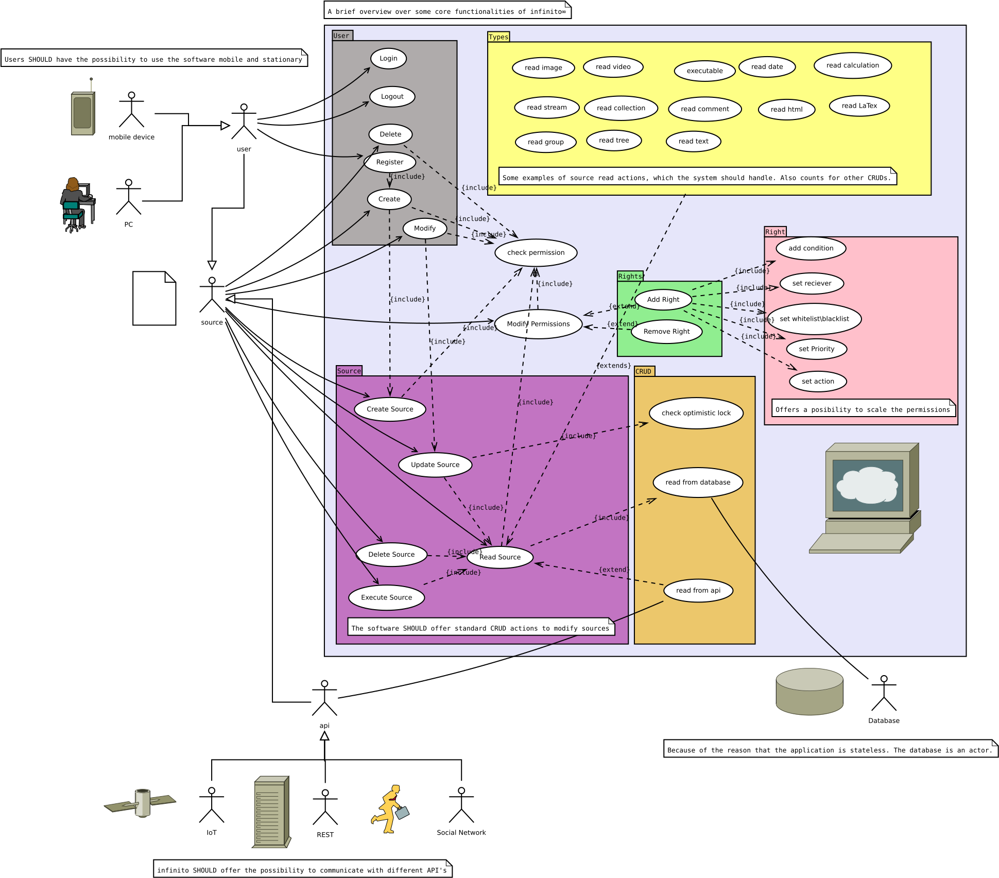
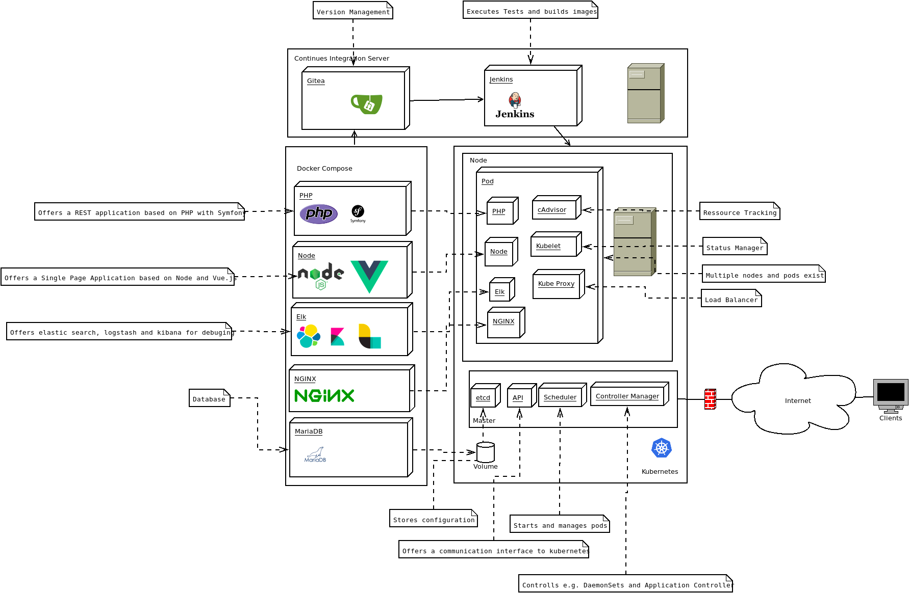

# ∞infinito
[](https://bestpractices.coreinfrastructure.org/projects/2448)
[](https://app.codacy.com/app/KevinFrantz/infinito?utm_source=github.com&utm_medium=referral&utm_content=KevinFrantz/infinito&utm_campaign=Badge_Grade_Dashboard)
[](https://travis-ci.org/KevinFrantz/infinito) [](https://codecov.io/gh/KevinFrantz/infinito) [](https://www.gnu.org/licenses/agpl-3.0) [](https://github.com/KevinFrantz/infinito/blob/master/CODE_OF_CONDUCT.md) [](https://en.wikipedia.org/wiki/Software_release_life_cycle)


## Idea

This software should offer a cloud based application\\framework for GUI and REST based development and data management.

### Core Functions, USP & Target
- High differentiable of rights for persons, groups and devices
- Data interface for persons and devices (IoT)
- Support of mixtures between executables and data
- Versioning of every state of the used data
- Automized transparency for users about their data and use
- Expanding the standard program paradigma of classes and objects through [sources](application/symfony/src/Entity/Source/README.md).
- Implementation of all big standard applications via API to manage them over one interface
- High scalability (IaaS compatible)

### Use Case
The following use case diagram is work in process and gives an short overview over the software and the actors.


## Administration
Further information you will find in the [administration README.md](./administration/README.md).

### Setup
To run the application you need docker.

After installing docker you just need to run
```bash
bash ./administration/init.sh
```
in the root directory of the repository.
## Architecture

### Application Architecture
Further information about the application and the architecture you will find in the [application README.md](./application/README.md).

### Server Architecture
To realize a high scalable and CI setup with [kubernetes](https://kubernetes.io/), [docker](https://www.docker.com/) and [Jenkins](https://jenkins.io/) use the following schema.


## Conventions
This project follows multiple conventions and rules apply to it. If you're interested in participating in this project you MUST follow them.

### Documentation
[Documentation conventions](./DOCUMENTATION_CONVENTION.md) apply to this project.

### License
The ["GNU AFFERO GENERAL PUBLIC LICENSE"](./LICENSE.txt) applies to this project.

### Code of Conduct
To contributions of this project the ["Contributor Covenant Code of Conduct"](./CODE_OF_CONDUCT.md) applies.

## Author
[Kevin Veen-Birkenbach](kevin@veen.world) \\ [Frantz](mail@Kevin-Frantz.de) <br />
 [Xing](https://www.xing.com/profile/Kevin_Frantz2/) | [LinkedIn](https://www.linkedin.com/in/kevinfrantz/)
