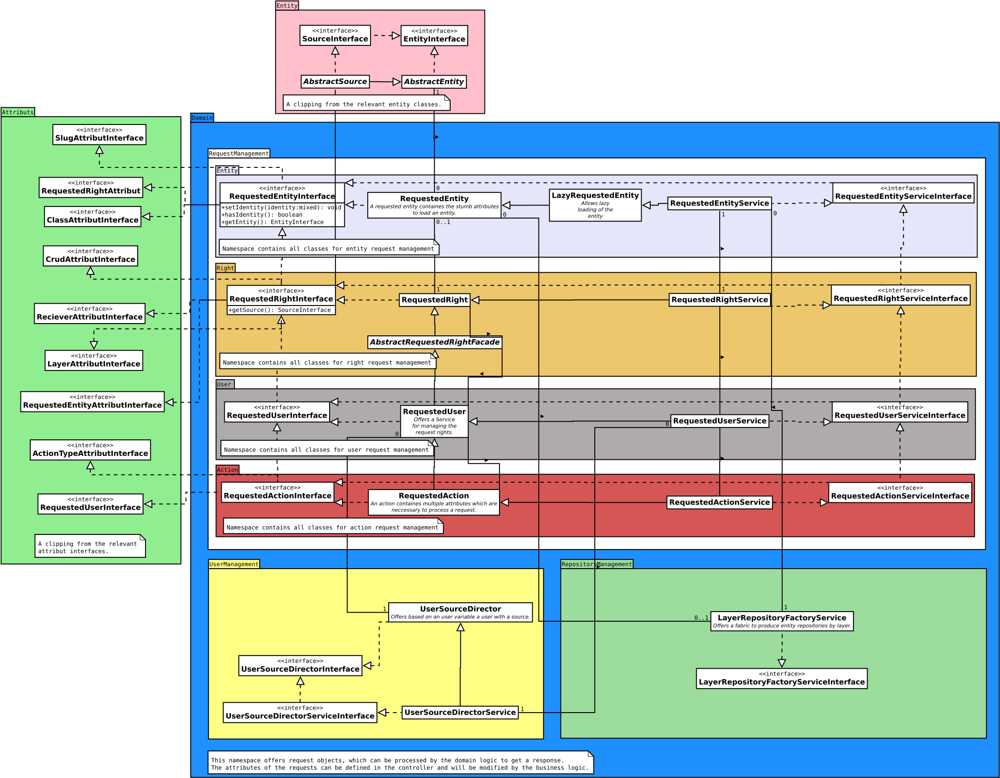

# Request Management
The request management works with different layers.

## Layers
Each layer contains out of __2 classes__ and __2 interfaces__ for it.
One class contains the __logic__ and the other class contains the __service__. This makes the classes easier testable and mockable and follows the [SOLID Design Principles](https://en.wikipedia.org/wiki/SOLID).

### Entity
A **requested entity** contains the attributes to manage the entity which should be handled by an action
#### Right
This is the basic request layer from which the other layers inhiere. A **requested right** contains a **requested entity**.

#### User
A **requested user** is a parent of **requested action** and contains out of one **requested right**.
#### Action
A **requested action** inhieres from **requested user** and contains a **requested user**.

## UML Class Diagram
The following diagram shows the relations between the different request layers and services:
